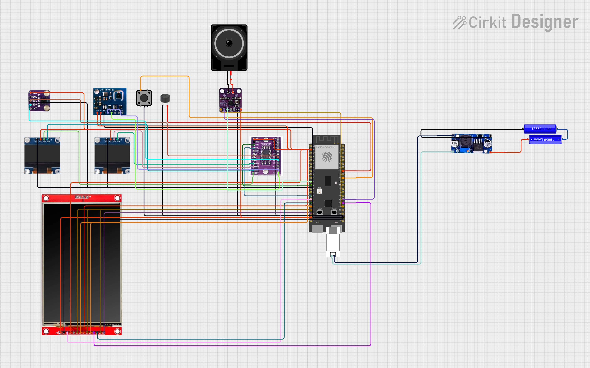

# 🤖 ELLA AI — Embodied Life Longevity Assistant
### by Dynamics Technologies

> **ELLA** (Embodied Life Longevity Assistant) is a smart, wearable-adjacent AI health and environmental monitoring device built on the ESP32-S3 platform. It fuses real-time biometric sensing, air quality monitoring, audio output, and a visual display interface into a compact, intelligent system designed to support human health and wellbeing.

---

## 📋 Table of Contents

- [Project Overview](#project-overview)
- [Circuit Diagram](#circuit-diagram)
- [Hardware Components](#hardware-components)
- [Pin Mapping](#pin-mapping)
- [System Architecture](#system-architecture)
- [Power Supply](#power-supply)
- [Getting Started](#getting-started)
- [License](#license)

---

## 🧠 Project Overview

ELLA AI is a multi-sensor embedded AI device developed by **Dynamics Technologies**. It integrates:

- **Health biometric monitoring** (heart rate & SpO2)
- **Environmental air quality sensing** (eCO2, TVOC, temperature, humidity)
- **Audio feedback** via a Class-D amplifier and loudspeaker
- **Dual OLED displays** for compact data visualization
- **4.0" TFT LCD touchscreen** for a full graphical AI interface
- **I²C multiplexing** to manage multiple sensors on a shared bus
- **Tactile input** for manual user interaction
- **Buzzer alerts** for threshold-based health or environmental warnings

ELLA is designed to act as a personal longevity assistant — continuously monitoring your body and environment, surfacing insights through AI, and delivering them via voice and display.

---

## 🔌 Circuit Diagram

The full ESP32-S3 Multi-Sensor and Audio Circuit is shown below:



> *Circuit diagram illustrating the complete wiring of the ESP32-S3 microcontroller with all peripheral sensors, displays, audio components, and power management.*

### Key Subsystems Visible in the Diagram:

| Subsystem | Components |
|---|---|
| Microcontroller | ESP32-S3 |
| Power Supply | Dual 3.7V LiPo → Buck Converter → 5V, USB Type-C |
| Health Sensing | GY-MAX30102 (Heart Rate / SpO2) |
| Environmental Sensing | ENS160 + AHT21 (eCO2, TVOC, Temp, Humidity) |
| I²C Multiplexing | TCA9548A (8-channel I²C Mux) |
| Display (Main) | 4.0" TFT LCD ST7796S |
| Display (Secondary) | 2× 0.96" OLED |
| Audio Amplifier | MAX98375 (Class-D, I²S) |
| Speaker | Loudspeaker (OUT via MAX98375) |
| Alert | Buzzer |
| Input | Tactile Switch Button |

---

## 🧩 Hardware Components

### Microcontroller
- **ESP32-S3** — dual-core Xtensa LX7, Wi-Fi + BLE, AI acceleration support

### Sensors
| Component | Function | Interface |
|---|---|---|
| **GY-MAX30102** | Heart Rate & Blood Oxygen (SpO2) | I²C |
| **ENS160 + AHT21** | Air Quality (eCO2, TVOC) + Temperature & Humidity | I²C |

### Multiplexer
| Component | Function | Channels Used |
|---|---|---|
| **TCA9548A** | I²C Bus Multiplexer | SC0/SC1 → OLEDs; SDA/SCL → Sensors |

### Displays
| Component | Size | Interface |
|---|---|---|
| **ST7796S TFT LCD** | 4.0 inch | SPI |
| **0.96" OLED** (×2) | 0.96 inch | I²C (via TCA9548A) |

### Audio
| Component | Role |
|---|---|
| **MAX98375** | Class-D I²S Audio Amplifier |
| **Loudspeaker** | Audio output (voice responses, alerts) |
| **Buzzer** | Simple digital alert/notification |

### Input
- **Tactile Switch Button** — user interaction / trigger

### Power
| Component | Role |
|---|---|
| **2× 3.7V LiPo Batteries** | Primary power source |
| **Buck Converter** | Steps down to regulated 5V |
| **USB Type-C Port** | Charging / programming interface |

---

## 📍 Pin Mapping

### ESP32-S3 to MAX98375 (Audio Amplifier)
| ESP32-S3 Pin | MAX98375 Pin | Signal |
|---|---|---|
| 18 | C5 | — |
| 21 | VN | — |
| 46 | DIN | I²S Data |
| 48 | SCK | I²S Clock |
| — | IN → OUT | Loudspeaker |

### ESP32-S3 to TCA9548A (I²C Multiplexer)
| ESP32-S3 Pin | TCA9548A Pin | Signal |
|---|---|---|
| SDA (9) | SDA (8) | I²C Data |
| SCL (9) | SCL (9) | I²C Clock |

### TCA9548A to Sensors & Displays
| TCA9548A Channel | Connected Device |
|---|---|
| SC0 / SD0 | 0.96" OLED #1 |
| SC1 / SD1 | 0.96" OLED #2 |
| SC2 / SD2 | (Expansion) |
| SC4 / SD4 | (Expansion) |
| SDA / SCL Bus | GY-MAX30102, ENS160+AHT21 |

### ESP32-S3 to ST7796S TFT LCD
| ESP32-S3 Pin | LCD Pin | Signal |
|---|---|---|
| 5V | 5V | Power |
| 3V3 | 3V | 3.3V Reference |
| 10 | SN | — |
| 11 | O1 | — |
| 12 | GND | Ground |
| 13 | D5 | SPI Data |
| 14 | A6 | — |
| 47 | CS | Chip Select |

### ESP32-S3 to Buzzer & Button
| ESP32-S3 Pin | Component | Signal |
|---|---|---|
| 37 | Buzzer | Digital Output |
| 36 | 3V3 | Buzzer Power |
| H (GPIO) | Tactile Switch | Digital Input |

---

## 🏗️ System Architecture

```
┌─────────────────────────────────────────────────────────┐
│                     POWER SYSTEM                         │
│    [3.7V LiPo x2] → [Buck Converter] → 5V Rail          │
│                          ↓                               │
│                    [Type-C Port]                         │
└─────────────────────────────────────────────────────────┘
                           │
                    ┌──────▼──────┐
                    │  ESP32-S3   │  (AI Core / MCU)
                    └──┬──────┬───┘
           ┌───────────┘      └──────────────┐
    ┌──────▼──────┐                   ┌──────▼──────┐
    │  TCA9548A   │  I²C Mux          │  MAX98375   │  Audio
    └──┬──┬──┬────┘                   └──────┬──────┘
       │  │  │                               │
  ┌────┘  │  └────┐                    [Loudspeaker]
  │       │       │
[OLED1] [OLED2] [GY-MAX30102]
                [ENS160+AHT21]

    [ST7796S 4" TFT LCD]   ← SPI
    [Buzzer]               ← GPIO
    [Tactile Button]       ← GPIO
```

---

## ⚡ Power Supply

ELLA AI is powered by two **3.7V lithium polymer (LiPo) batteries** connected through a **Buck Converter** that regulates the output to a stable **5V** for the system. A **USB Type-C port** is provided for both charging the batteries and flashing firmware to the ESP32-S3.

---

## 🚀 Getting Started

### Prerequisites
- Arduino IDE or PlatformIO
- ESP32-S3 board support package
- Required libraries:
  - `Adafruit_MAX3010x` — heart rate & SpO2
  - `ScioSense_ENS160` — air quality
  - `Adafruit_AHTX0` — temperature & humidity
  - `TFT_eSPI` — ST7796S display
  - `Adafruit_SSD1306` — OLED displays
  - `Wire` — I²C communication
  - `I2Cdev` / `TCA9548A` — I²C multiplexer

### Hardware Assembly
1. Wire power from LiPo batteries through Buck Converter to the 5V rail.
2. Connect the TCA9548A to the ESP32-S3's I²C pins (SDA/SCL).
3. Wire sensors (GY-MAX30102, ENS160+AHT21) to TCA9548A channels.
4. Connect OLED displays to designated TCA9548A channels.
5. Wire the ST7796S TFT LCD via SPI to the ESP32-S3.
6. Connect MAX98375 audio amplifier via I²S pins.
7. Attach buzzer and tactile button to GPIO pins.
8. Upload firmware via USB Type-C.

### Flashing Firmware
```bash
# Clone the repository
git clone https://github.com/dynamics-technologies/ella-ai.git
cd ella-ai

# Open in Arduino IDE or PlatformIO and flash to ESP32-S3
```

---

## 📄 License

This project is developed and maintained by **Dynamics Technologies**.  
All rights reserved © 2026 Dynamics Technologies.

---

<div align="center">

**ELLA AI** — *Embodied Life Longevity Assistant*  
Built with ❤️ by [Dynamics Technologies](https://github.com/dynamics-technologies)

</div>
